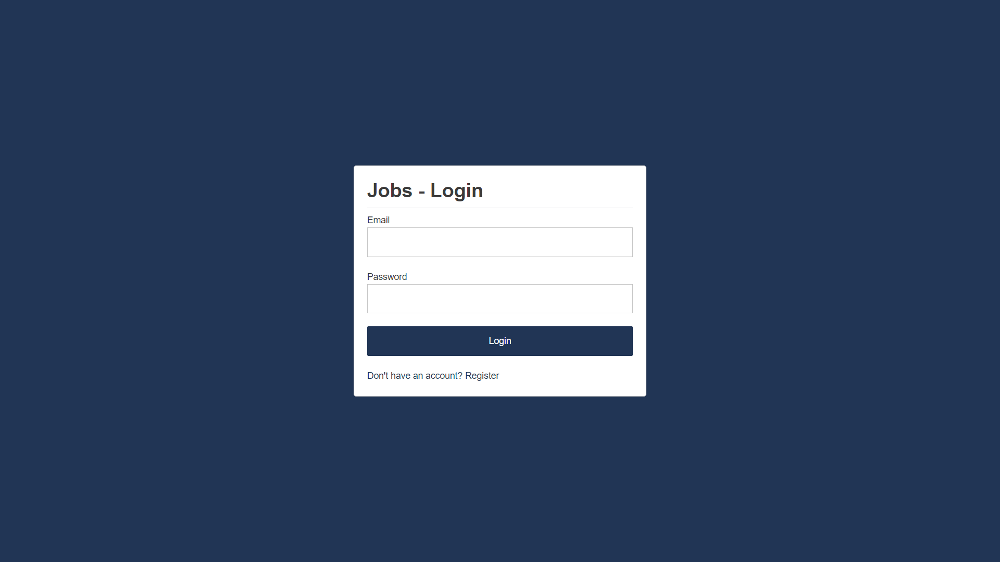
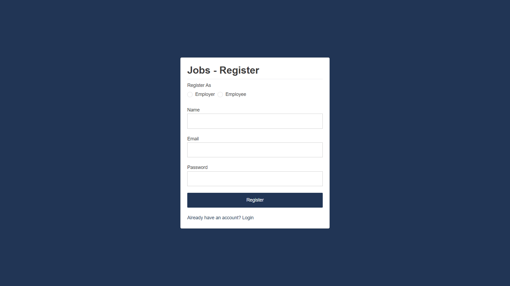
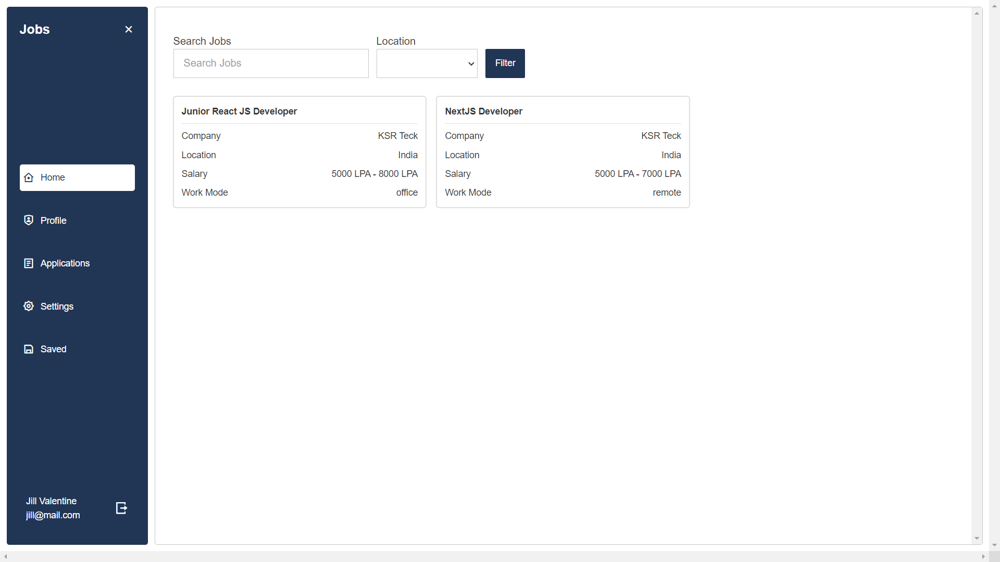
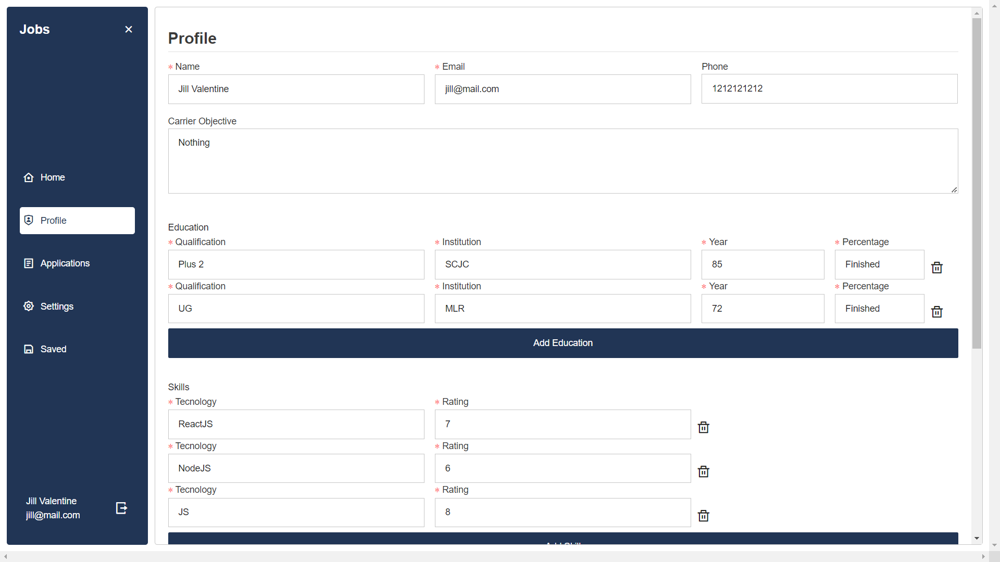
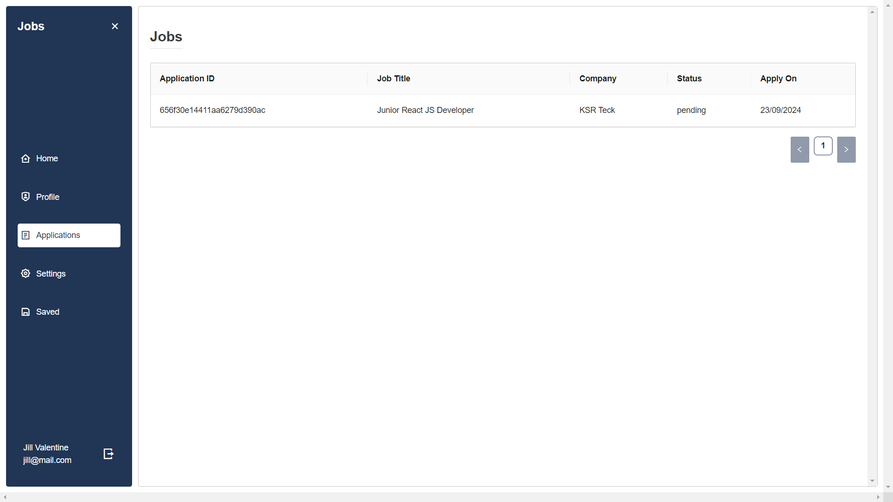

# Job Portal Application

Este é um portal de empregos desenvolvido com Next.js 13, MongoDB, Ant Design (antd), TailwindCSS e TypeScript. O projeto visa fornecer uma plataforma intuitiva para empregadores postarem vagas de emprego e candidatos se inscreverem nelas.

## Tecnologias Utilizadas

- **Next.js 13**: Framework React para desenvolvimento front-end e back-end.
- **MongoDB**: Banco de dados NoSQL para armazenar informações sobre empregos e candidatos.
- **Ant Design (antd)**: Biblioteca de componentes para construir interfaces de usuário modernas e responsivas.
- **TailwindCSS**: Framework de utilitários para estilização rápida e customização.
- **TypeScript**: Linguagem que adiciona tipagem estática ao JavaScript, melhorando a robustez do código.

## Funcionalidades

- Cadastro de usuários (empregadores e candidatos).
- Autenticação JWT.
- Postagem e gerenciamento de vagas de emprego.
- Aplicação a vagas de emprego por candidatos.
- Sistema de busca e filtragem de vagas.
- Dashboard para empregadores e candidatos.

## Instalação

1. Clone este repositório:

    ```bash
    git clone https://github.com/Grazziano/job-portal.git
    cd job-portal-application
    ```

2. Instale as dependências:

    ```bash
    npm install
    ```

3. Configure as variáveis de ambiente:

    Crie um arquivo `.env.local` na raiz do projeto e adicione as seguintes variáveis:

    ```bash
    MONGO_URL=your_mongodb_connection_string
    JWT_SECRET=your_jwt_secret
    AUTH_USER=your_auth_email
    AUTH_PASSWORD=your_auth_password
    ```

4. Execute o projeto:

    ```bash
    npm run dev
    ```

    O projeto estará disponível em `http://localhost:3000`.

## Imagens

Aqui você pode adicionar capturas de tela do seu projeto para mostrar seu layout e funcionalidade. Exemplos:


*Login*


*Register*


*Home page com listagem de vagas*


*Perfil do usuário*


*Vagas inscritas*

## Contribuição

Sinta-se à vontade para abrir issues e enviar pull requests para melhorias.

## Licença

Este projeto está licenciado sob a Licença MIT. Consulte o arquivo `LICENSE` para mais informações.
